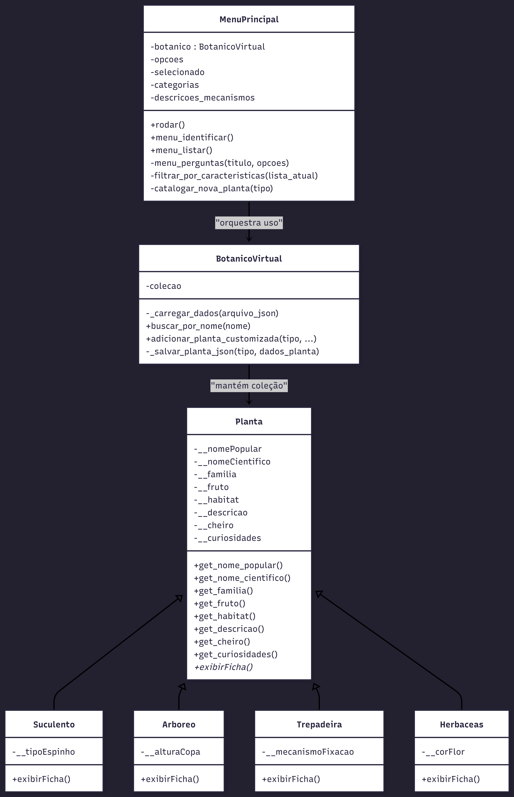

Projetos Final – POO (2025-2)
============================

Sistema em Python para identificação e classificação de plantas brasileiras, desenvolvido para a disciplina de Programação Orientada a Objetos (POO). O projeto modela categorias botânicas via classes, aplica os pilares de POO e oferece um menu interativo para consultar fichas e identificar espécies a partir de perguntas guiadas.

By: Pablo P. Barbosa

## Como rodar
- Requisitos: Python 3.10+ e o pacote `keyboard`.
- Instalação de dependência: `pip install keyboard`
- Execução (Windows / PowerShell): `python Main.py`

## Estrutura do repositório
- Main.py — ponto de entrada que instancia o gerenciador e inicia o menu.
- Menu.py — fluxo de navegação, questionário de identificação e listagem.
- BotanicoVirtual.py — carrega/salva dados e mantém a coleção em memória.
- Plants.py — hierarquia de classes (`Planta`, `Suculento`, `Arboreo`, `Trepadeira`, `Herbaceas`).
- plantas.json — base de dados das espécies (características e descrições).
- UML.png — diagrama UML exportado.
- Menu Inicial.jpeg, Menu Questionario.jpeg, Ficha exemplo.jpeg — evidencias de execucao.

## Diagrama de classes
- Visual: 
- Fonte (Mermaid):

## Como usar
1) Rode `python Main.py`.
2) Use as setas do teclado para navegar e `Enter` para confirmar.
3) Escolha “Identificar uma Planta” e responda ao funil de perguntas por grupo (cacto/suculenta, árvore, trepadeira ou herbácea).
4) Consulte fichas completas em “Ver Plantas Existentes”.

## Evidências
- Menu inicial: 
- Questionario: 
- Ficha exibida: 

## Pilares de POO aplicados
- Abstração/encapsulamento: atributos privados em `Planta` e getters explícitos.
- Herança: subclasses `Suculento`, `Arboreo`, `Trepadeira`, `Herbaceas` especializam `Planta`.
- Polimorfismo: `exibirFicha()` sobrescrito em cada subclasse.
- Modularização: múltiplos arquivos importados em `Main.py`, conforme exigido.

## Entregas e prazos (da disciplina)
- Repositório com README, código e diagrama UML.
- Envio do link até 20 de janeiro (23h30) via Classroom.
- Apresentação em 21 de janeiro (8h), formato pitch de até 5 minutos.
- A última versão comitada antes da apresentação será a avaliada.

Bonificação: implementação alternativa em C++ ou Java.

## Critérios de avaliação
- Apresentação (slides, clareza, tempo e execução ao vivo): 3 pts
- Organização do repositório Git: 2 pts
- Coerência da solução com a classificação real das plantas: 2 pts
- Uso adequado dos pilares de POO: 3 pts
